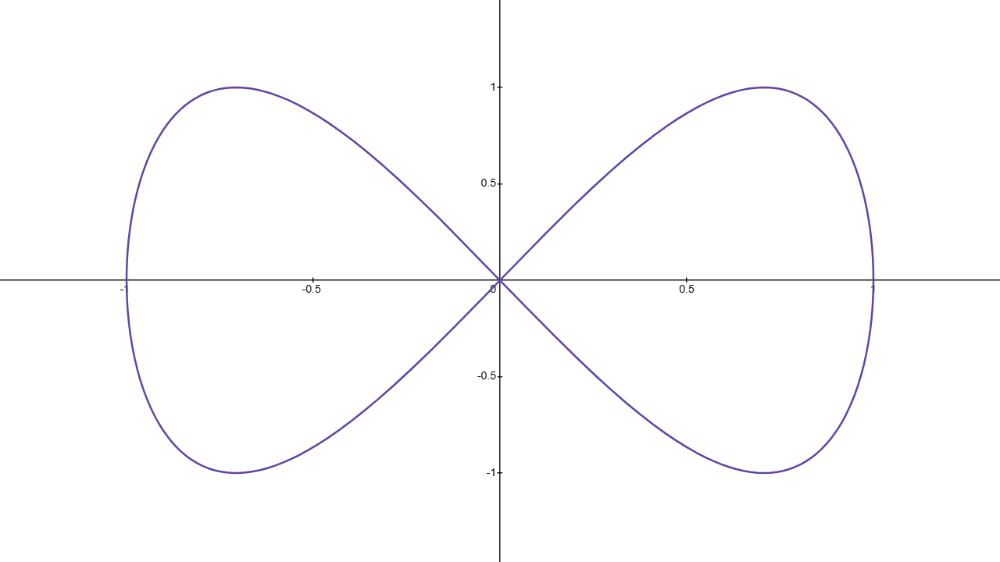
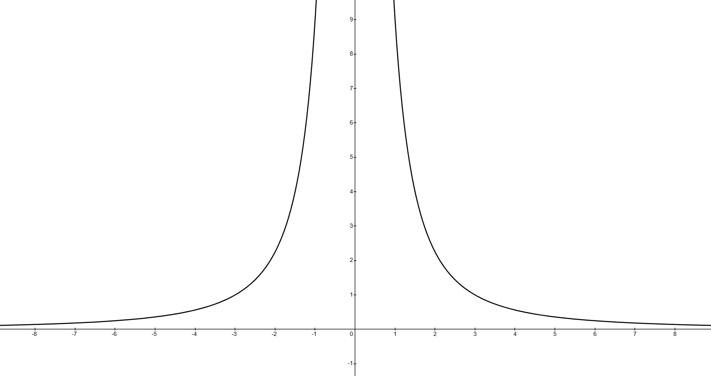
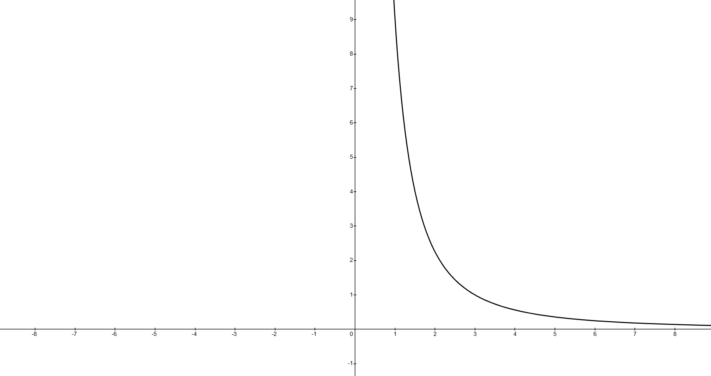

# Introduction

Previously, we have defined functions like $f(x)$ or $y$ as being solely functions of $x$. Mathematically, these functions are known as "single variable" or "univariate" functions and look like $y=f(x)$. However, it is possible to also express both $x$ and $y$ as functions of a third variable, say $t$. There is nothing significant about using the variable $t$, it can be replaced by any other variable, but $t$ is most commonly used. When both $x$ and $y$ are expressed in terms of $t$, the resulting functions are called **parametric equations** and the variable $t$ is called the **parameter**. These equations are broadly speaking, written as $x=f(t)$ and $y=g(t)$ and carve out the set of points $(x, y)$ that define the **parametric curve**.

::: {.callout-note title="Applications of Parametric Curves"}

Parametric curves see a lot of usage in physics and computer graphics. Most, if not all, computer-aided design (CAD) softwares use some form of parametric curves to generate their curves and splines. A more tangible example is in physics where the trajectory of an object or particle may be written a function of time, $t$. In this case, the position is typically described as a **vector** instead of a scalar quantity like displacement.

$$
\textbf r(t)=\textbf x(t)\hat i+\textbf y(t)\hat j+\textbf z(t)\hat k
$$

Since the velocity is defined as the derivative of position, then $\textbf v(t)=\frac {\mathrm d\textbf r}{\mathrm dt}$ and the velocity is simply

$$
\textbf v(t)=\textbf x'(t)\hat i+\textbf y'(t)\hat j+\textbf z'(t)\hat k
$$

Enough about physics. The goal here is to introduce parametric curves and how useful they can potentially be! Certain problems may be seem complicated at first, but when decomposed into parametric form, the math becomes easier to solve.

:::

# Sketching

Each value of $t$ corresponds to a unique point $(x, y)$ on the parametric curve. As $t$ changes, the point $(x, y)$ will move along the curve in a certain direction. The direction that the $(x, y)$ point moves along the curve is called the **orientation**. There are many ways of sketching a parametric curve.

## Plotting Points {#sec-plotting-points}

The most straightforward way of sketching a parametric curve is to simply plot points. This is done by plugging in different values of $t$ into the parametric equations and plotting the resulting $(x, y)$ points on the Cartesian plane. By plotting enough points, we can get a good idea of what the curve looks like. If we consider the curve

$$
\begin{aligned}
x & =\sin t \\
y & =\sin 2t
\end{aligned}
$$ {#eq-sketching-plotting-points-example}

The plot for @eq-sketching-plotting-points-example is shown below. Parametric curves can be plotted in Desmos using the notation $(x(t), y(t))$. For @eq-sketching-plotting-points-example, the Desmos input would be $(\sin t, \sin 2t)$.

{#fig-sketching-plotting-points-example-plot width=550 .lightbox}

We can evaluate points for $t$ at regular intervals to get a better idea of the shape of the curve. The table below shows values for $x$ and $y$ at regular intervals of $t$.

| $t$         | $0$ | $\frac {\pi}4$ | $\frac {\pi}2$ | $\frac {3\pi}4$    | $\pi$ | $\frac {5\pi}4$     | $\frac {3\pi}2$ | $\frac {7\pi}4$     | $2\pi$ |
|:-----------:|:---:|:--------------:|:--------------:|:------------------:|:-----:|:-------------------:|:---------------:|:-------------------:|:------:|
| $x=\sin t$  | $0$ | $0$            | $1$            | $\frac {\sqrt 2}2$ | $0$   | $-\frac {\sqrt 2}2$ | $-1$            | $-\frac {\sqrt 2}2$ | $0$    |
| $y=\sin 2t$ | $0$ | $1$            | $0$            | $-1$               | $0$   | $1$                 | $0$             | $-1$                | $0$    |

Plotting these points on the $xy$-plane gives @fig-sketching-plotting-points-example-plot. By plotting more points, we can get a better idea of the shape of the curve. The orientation of the curve starts off at the origin, $(0, 0)$, and moves in a counterclockwise-esque direction towards $\left(\frac {\sqrt 2}2, 1\right)$, and then moves down towards $\left(\frac {\sqrt 2}2, -1\right)$, before returning back to the origin and then towards $\left(-\frac {\sqrt 2}2, 1\right)$, and so on. Arrows are typically drawn on the curve to indicate the curve's orientation. For the orientation in this curve, see Slide #3 from lecture.

A significant downside of this method is that it can be very time-consuming and may not always give an accurate representation of the curve, especially if the curve has a lot of twists and turns.

## Eliminating the Parameter with Substitution {#sec-eliminating-parameter-substitution}

A second way to sketch a curve is to rewrite as a Cartesian equation by eliminating the parameter. One way of doing this is to solve for $t$ (i.e., solve either equation for $t=\ldots$) and then substituting the resulting expression into the other equation. For example, if we have the parametric equations

$$
\begin{aligned}
x & =-t^2 \\
y & =2t+5
\end{aligned}
$$ {#eq-sketching-eliminating-parameter-example}

Solving either $x$ or $y$ can be done, but it is easier to solve for $t$ in the $y$ equation since it is linear (no fancy square roots or powers like you would get if you solved for $t$ in the $x$ equation). This gives $t=\frac {y-5}2$ and substituting into the equation for $x$ gives

$$
x=-\left(\frac {y-5}2\right)^2
$$ {#eq-sketching-eliminating-parameter-example-cartesian}

The curve for this equation depicts a quadratic function since $x$ is a function of $y^2$ plus some other terms. Moreover, since there is a negative term in front, the parabola opens to the left and the vertex occurs at $(0, 5)$. The orientation for this parametric curve must still be determined by substituting in values for $t$ and plotting the resulting points. For instance, when $t=-1$, then $(x(t), y(t))=(-1, 3)$, and when $t=0$, the point moves to $(x(t), y(t))=(0, 5)$, so the orientation starts from the bottom left corner and moves in the counterclockwise direction towards the vertex then towards the top left corner. To visualize the orientation, see Slide #5 from lecture.

An important point to note is that the possible values for $x$ and $y$ are restricted by the allowable values for $t$. With the examples so far, $t$ could have been any real value and as a result, all possible values of $x$ and $y$ were allowed. Therefore, $-\infty<x<\infty$ and $-\infty<y<\infty$. However, if $t$ is restricted to a certain interval, then the possible values for $x$ and $y$ will also be restricted. An example of this is given in the proceding section.

## Eliminating the Parameter with an Identity {#sec-eliminating-parameter-identity}

This method is very similar to @sec-eliminating-parameter-substitution, but instead of solving for $t$ and substituting, we can use an identity to eliminate the parameter. This is most commonly used for parametric equations involving parametric equations. For brevity, here are the three Pythagorean trigonometric identities.

$$
\begin{aligned}
\sin^2\theta+\cos^2\theta & =1 \\
1+\tan^2\theta & =\sec^2\theta \\
1+\cot^2\theta & =\csc^2\theta
\end{aligned}
$$ {#eq-trigonometric-identities}

For example, if we have the parametric equations

$$
\begin{aligned}
x & =\sin t \\
y & =\cos^2 t
\end{aligned}
$$ {#eq-sketching-eliminating-parameter-identity-example}

Then the most applicable identity from @eq-trigonometric-identities is $\sin^2\theta+\cos^2\theta=1$ since $x$ and $y$ are both expressible in terms of $\sin t$ and $\cos t$. Mathematically, then

$$
\sin^2t+\cos^2t=x^2+y=1
$$ {#eq-sketching-eliminating-parameter-identity-example-cartesian}

This describes a parabola that opens downwards along the $y$-axis with a vertex at $(0, 1)$. If this is not obvious, solve for $y$ to get $y=1-x^2$. The range of possible $x$ and $y$ values, however, is restricted. The allowable values for $t$ can be any real number since $t$ is unrestricted. Mathematically, $-\infty<t<\infty$. However, since $x$ and $y$ are both defined in terms of $\sin t$ and $\cos t$, the possible values for $x$ and $y$ are restricted to be between $[-1, 1]$ and $[0, 1]$ respectively. To visualize this, plot $y=\sin x$ and $y=\cos^2 x$ in Desmos and observe the possible values for $y$ as $x$ changes. As a result, only the parts of the parabola between $-1\leq x\leq1$ and $0\leq y\leq1$ should be plotted.

The orientation can be determined by plugging in values for $t$. For instance, when $t=-\frac {\pi}2$, then the point is $(x, y)=(-1, 0)$ and when $t=0$, the point moves towards $(x, y)=(0, 1)$. Finally, when $t=\frac {\pi}2$, the point moves towards $(x, y)=(0, 1)$. If we had stopped here, we would have made the grave mistake of assuming the orientation starts from the left side of the parabola and only moves in the clockwise direction towards the right. This is **not** the case. If we had continued to plug in larger values of $t$, such as when $t=\pi$, we would have seen that the point actually moves back to $(x, y)=(0, 1)$, and if $t$ continues to increase to $t=\frac {3\pi}2$, the point moves back to where we started at $t=-\frac {\pi}2$. Therefore, the orientation is actually a back-and-forth motion between the left and right sides of the parabola. If we start at the left side of the parabola at $(-1, 0)$, the point then moves in the clockwise direction towards $(1, 0)$, before circling back onto itself and moving back counterclockwise towards $(-1, 0)$. This continues indefinitely since $t$ can be any real number. To visualize the orientation, see Slide #7 from lecture.

# Examples

**Problem:** Find and plot the Cartesian equation for the following parametric equations.

$$
\begin{aligned}
x(t) & =\frac 3{e^t} \\
y(t) & =e^{2t}
\end{aligned}
$$ {#eq-example-1}

It's helpful to start off with noticing what possible values of $x$ and $y$ define the parametric curve. Since $t$ can be any real number, then $-\infty<t<\infty$. However, since $x(t)=\frac 3{e^t}$, the possible values for $x$ are restricted to be $x>0$. This is because regardless of what value of $t$ we plug in, $e^t$ will always be positive, so $x$ is then a positive number, $3$, divided by another positive number, $e^t$. Therefore, $x>0$ is the only possible range of $x$ values. In a similar vein, $y>0$ since $e^{2t}$ is also always positive for any value of $t$ substituted.

With this in mind, we may derive the Cartesian equation for @eq-example-1. We may use the method outlined in @sec-eliminating-parameter-substitution. The plotting points method outlined in @sec-plotting-points is not ideal since it doesn't actually present us the Cartesian equation for the curve, only a cloud of points on the $xy$-plane. And the method outlined in @sec-eliminating-parameter-identity is not very useful since there are no trigonometric functions in @eq-example-1. Therefore, we will solve for $t$ (or some equivalent expression for $t$) and substitute into the other equation.

It does not matter which equation we use, but for convenience, take the $x$ equation. Using the $y$ equation would require an annoying square root (because of the $2t$ power) as well as a natural logarithm. Starting with $x$, solve for $e^t$.

$$
e^t=\frac 3x
$$

We *can* solve for $t$ explicitly by taking the natural logarithm of both sides to get $t=\ln\left(\frac 3x\right)$, but this is not necessary since the equation for $y$ is already defined in terms of $e^t$. In fact

$$
y=e^{2t}=\left(e^t\right)^2=\left(\frac 3x\right)^2
$$

Therefore, the Cartesian equation for the curve is $y=\left(\frac 3x\right)^2$ for $x>0$ and $y>0$. This is where the domain ($x>0$) and range ($y>0$) restrictions come into play. If we had skipped that step, we would have plotted the curve in @fig-example-1-graph-wrong and been done!

::: {#fig-example-1-graphs layout-ncol=2}

{#fig-example-1-graph-wrong width=100% .lightbox}

{#fig-example-1-graph-correct width=100% .lightbox}

Correct and incorrect plots of the Cartesian equation for @eq-example-1. The correct plot only includes the part of the curve where $x>0$ and $y>0$.
:::

This is clearly wrong, since based off the allowed values of $t$, $x$ and $y$ must both be positive. Therefore, the actual correct plot of of @eq-example-1 is shown in @fig-example-1-graph-correct.